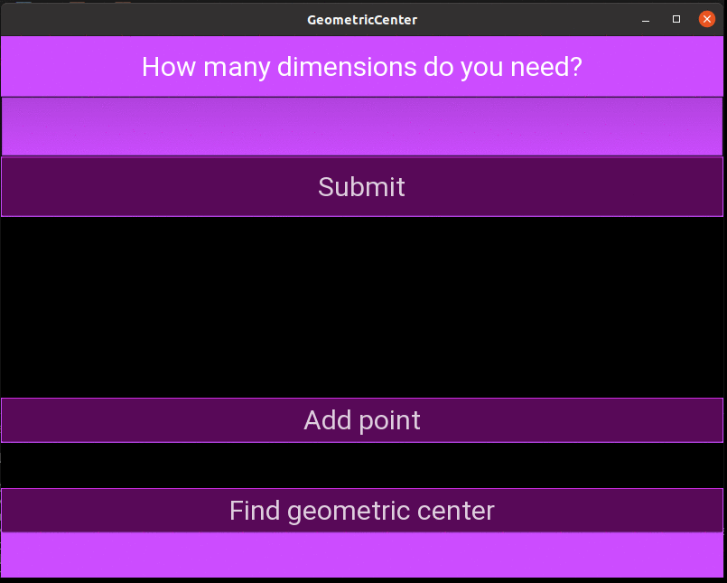

# Geometric Center (Centroid) Finder

## The program was created to learn how to use multi-level loops, it was my second program with GUI written in `kivy` with "Request and Response" method where backend and frontend are in separate files. The main gui issues were to generate as many `text_inputs` as user needs (dimensions) and change `button` text and disable it after use. 

### There are tests in `.unittest` and second gui in `tkinter`.

### This program finds geometric center of group of points.
### 

